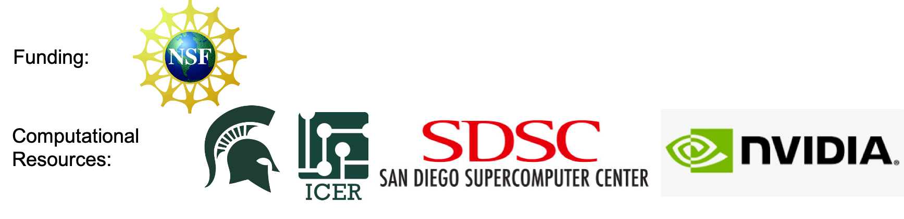

About QUICK QM Package
======================

QUICK is a GPU enabled *ab initio* and density functional theory software capable of performing electronic
structure calculations on general organic/biomolecular systems. It was initially developed by Ed Brothers. His work includes the development of the Hartree-Fock and density functional theory energy and gradient calculations, geometry optimization routines, and Mulliken charge analysis. Afterward, Ken Ayers and Xiao He optimized the code.
Yipu Miao implemented the GPU enabled ERI engine and laid the foundation for GPU enabled DFT calculations.
Jamie Smith has contributed the CMake build system.
Vinícius Wilian D. Cruzeiro contributed to enable QM/MM simulations with AMBER.
Timothy J. Giese contributed to enable long range interactions in QM/MM.    
Kris Keipert, Kamesh Arumugam, Kyle Jacobs, Stefan Maintz, Peng Wang and Jonathan Lefman from NVIDIA provided useful suggestions on various technical aspects to improve the code. 

Madu Manathunga, Akhil Shajan, Andy Götz and Kennie Merz currently develop and maintain the code. 

Contact: `quick.merzlab@gmail.com <quick.merzlab@gmail.com>`_

*Last updated by Madu Manathunga on 03/03/2022.*
