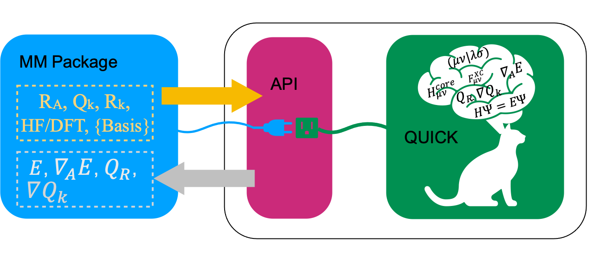

Developer Guide
===============

QUICK API
---------

Starting from version 20.06, QUICK build system compiles the source code and creates static or
shared object libraries. Such libraries are then linked to the main QUICK program. Assuming that
user specifies a prefix (*$installdir*) during the configuration of legacy or CMake builds, libraries will be located inside
*$installdir/lib/$buildtype* where *$buildtype* could be *serial*, *mpi* or *cuda*. Required .mod or 
header files can be found inside *$QUICK_HOME/include/$buildtype*.

It is possible to link QUICK libraries into external MM programs and obtain HF/DFT energies, gradients
and point charge gradients through the Fortran 90 QUICK API and perform QM/MM calculations. We will explain the usage of the API
with an example.

Let us consider a simple system containing a water molecule surrounded by 3 point charges. We now create the
following fortran module (test_module.f90) and store atomic coordinates and charges for 5 snapshots. Furthermore, we implement
several subroutines to load test data and print data retrieved from QUICK.

::

	! Test module for QUICK API
	module test_quick_api_module
	
	  implicit none
	  private
	
	  public :: loadTestData, printQuickOutput
	
	#ifdef MPIV
	  public :: mpi_initialize, printQuickMPIOutput, mpi_exit
	#endif
	
	  ! A test system with one water molecule and 3 point charges.
	  ! Atomic coordinates, external point charges and their coordinates
	  ! for five snapshots. 
	  double precision, dimension(1:45) :: all_coords
	  double precision, dimension(1:60) :: all_extchg
	
	  data all_coords &
	  /-0.778803, 0.000000, 1.132683, &
	   -0.666682, 0.764099, 1.706291, &
	   -0.666682,-0.764099, 1.706290, &
	   -0.678803, 0.000008, 1.232683, &
	   -0.724864, 0.755998, 1.606291, &
	   -0.724862,-0.756005, 1.606290, &
	   -0.714430, 0.000003, 1.267497, &
	   -0.687724, 0.761169, 1.624424, &
	   -0.687723,-0.761172, 1.624427, &
	   -0.771504, 0.000000, 1.167497, &
	   -0.669068, 0.763767, 1.697008, &
	   -0.669068,-0.763767, 1.697008, &
	   -0.771372, 0.000000, 1.162784, &
	   -0.668845, 0.767538, 1.698983, &
	   -0.668845,-0.767538, 1.698982/
	
	    data all_extchg &
	  /1.6492, 0.0000,-2.3560, -0.8340, &
	   0.5448, 0.0000,-3.8000,  0.4170, &
	   0.5448, 0.0000,-0.9121,  0.4170, &
	   1.6492, 0.0000,-2.3560, -0.8360, &
	   0.5448, 0.0000,-3.8000,  0.4160, &
	   0.5448, 0.0000,-0.9121,  0.4160, &
	   1.6492, 0.0000,-2.3560, -0.8380, &
	   0.5448, 0.0000,-3.8000,  0.4150, &
	   0.5448, 0.0000,-0.9121,  0.4150, &
	   1.6492, 0.0000,-2.3560, -0.8400, &
	   0.5448, 0.0000,-3.8000,  0.4140, &
	   0.5448, 0.0000,-0.9121,  0.4140, &
	   1.6492, 0.0000,-2.3560, -0.8420, &
	   0.5448, 0.0000,-3.8000,  0.4130, &
	   0.5448, 0.0000,-0.9121,  0.4130/
	
	   ! number of point charges per frame
	   integer :: nptg_pframe = 3
	
	  interface loadTestData
	    module procedure load_test_data
	  end interface loadTestData
	
	contains
	
	  subroutine load_test_data(frame, natoms, nxt_charges, coord, xc_coord)
	
	    implicit none
	
	    integer, intent(in)             :: frame, natoms, nxt_charges
	    double precision, intent(inout) :: coord(3, natoms)
	    double precision, intent(out)   :: xc_coord(4, nxt_charges)
	    integer :: i, j, k
	
	    k=natoms*3*(frame-1) + 1
	    do i=1,natoms
	      do j=1,3
	        coord(j,i) = all_coords(k)
	        k=k+1
	      enddo
	    enddo
	
	    if(nxt_charges>0) then
	      k=nptg_pframe*4*(frame-1) + 1
	      do i=1,nxt_charges
	        do j=1,4
	          xc_coord(j,i) = all_extchg(k)
	          k=k+1
	        enddo
	      enddo
	    endif
	
	  end subroutine load_test_data
	
	#ifdef MPIV
	  ! Initialize mpi library and save mpirank and mpisize.
	  subroutine mpi_initialize(mpisize, mpirank, master, mpierror)
	
	    implicit none
	
	    integer, intent(inout) :: mpisize, mpirank, mpierror
	    logical, intent(inout) :: master
	
	    include 'mpif.h'
	
	    call MPI_INIT(mpierror)
	    call MPI_COMM_RANK(MPI_COMM_WORLD,mpirank,mpierror)
	    call MPI_COMM_SIZE(MPI_COMM_WORLD,mpisize,mpierror)
	    call MPI_BARRIER(MPI_COMM_WORLD,mpierror)
	
	    if(mpirank .eq. 0) then
	      master = .true.
	    else
	      master = .false.
	    endif
	
	  end subroutine mpi_initialize
	
	  ! Prints mpi output sequentially.
	  subroutine printQuickMPIOutput(natoms, nxt_charges, atomic_numbers, &
	    totEne, gradients, ptchg_grad, mpirank)
	
	    implicit none
	
	    integer, intent(in)          :: natoms, nxt_charges, mpirank
	    integer, intent(in)          :: atomic_numbers(natoms)
	    double precision, intent(in) :: totEne
	    double precision, intent(in) :: gradients(3,natoms)
	    double precision, intent(in) :: ptchg_grad(3,nxt_charges)
	
	    write(*,*) ""
	    write(*,'(A11, 1X, I3, 1x, A3)') "--- MPIRANK", mpirank, "---"
	    write(*,*) ""
	
	    call printQuickOutput(natoms, nxt_charges, atomic_numbers, totEne, &
	    gradients, ptchg_grad)
	
	  end subroutine printQuickMPIOutput
	
	  subroutine mpi_exit
	
	    implicit none
	    integer :: mpierror
	
	    include 'mpif.h'
	
	    call MPI_FINALIZE(mpierror)
	    call exit(0)
	
	  end subroutine mpi_exit
	
	#endif
	
	
	  subroutine printQuickOutput(natoms, nxt_charges, atomic_numbers, totEne, &
	    gradients, ptchg_grad)
	
	    implicit none
	
	    integer, intent(in)          :: natoms, nxt_charges
	    integer, intent(in)          :: atomic_numbers(natoms)
	    double precision, intent(in) :: totEne
	    double precision, intent(in) :: gradients(3,natoms)
	    double precision, intent(in) :: ptchg_grad(3,nxt_charges)
	    integer :: i, j
	
	    ! Print energy  
	    write(*,*) ""
	    write(*,*) "*** TESTING QUICK API ***"
	    write(*,*) ""
	    write(*,*) "PRINTING ENERGY"
	    write(*,*) "---------------"
	    write(*,*) ""
	    write(*, '(A14, 3x, F14.10, 1x, A4)') "TOTAL ENERGY =",totEne,"A.U."
	
	    ! Print gradients
	    write(*,*) ""
	    write(*,*) "PRINTING GRADIENTS"
	    write(*,*) "------------------"
	    write(*,*) ""
	    write(*, '(A14, 3x, A6, 10x, A6, 10x, A6)') "ATOMIC NUMBER","GRAD-X","GRAD-Y","GRAD-Z"
	
	    do i=1,natoms
	      write(*,'(6x, I5, 2x, F14.10, 2x, F14.10, 2x, F14.10)') atomic_numbers(i), &
	      gradients(1,i), gradients(2,i), gradients(3,i)
	    enddo
	
	    ! Print point charge gradients
	    if(nxt_charges>0) then
	      write(*,*) ""
	      write(*,*) "PRINTING POINT CHARGE GRADIENTS"
	      write(*,*) "-------------------------------"
	      write(*,*) ""
	      write(*, '(A14, 3x, A6, 10x, A6, 10x, A6)') "CHARGE NUMBER","GRAD-X","GRAD-Y","GRAD-Z"
	
	      do i=1,nxt_charges
	        write(*,'(6x, I5, 2x, F14.10, 2x, F14.10, 2x, F14.10)') i, ptchg_grad(1,i), &
	        ptchg_grad(2,i), ptchg_grad(3,i)
	      enddo
	    endif
	
	    write(*,*) ""
	
	  end subroutine printQuickOutput
	
	end module

Next, we implement the following example program (example.f90) that uses the above module and call QUICK through the API.

::

	! Program for testing QUICK API
	program test_quick_api
	
	    use test_quick_api_module, only : loadTestData, printQuickOutput
	    use quick_api_module, only : setQuickJob, getQuickEnergy, &
	    getQuickEnergyGradients, deleteQuickJob 
	    use quick_exception_module
	#ifdef MPIV
	    use test_quick_api_module, only : mpi_initialize, printQuickMPIOutput, mpi_exit
	    use quick_api_module, only : setQuickMPI
	#endif
	
	    implicit none
	
	#ifdef MPIV
	    include 'mpif.h'
	#endif
	
	    ! i, j are some integers useful for loops, frames is the number of
	    ! test snapshots (md steps), ierr is for error handling
	    integer :: i, j, frames, ierr
	   
	    ! number of atoms, number of atom types, number of external point charges
	    integer :: natoms, nxt_charges
	
	    ! atom type ids, atomic numbers, atomic coordinates, point charges and
	    !  coordinates
	    integer, allocatable, dimension(:)            :: atomic_numbers 
	    double precision, allocatable, dimension(:,:) :: coord          
	    double precision, allocatable, dimension(:,:) :: xc_coord       
	
	    ! name of the quick template input file
	    character(len=80) :: fname
	
	    ! job card
	    character(len=200) :: keywd
	
	    ! total qm energy, mulliken charges, gradients and point charge gradients
	    double precision :: totEne
	    double precision, allocatable, dimension(:,:) :: gradients         
	    double precision, allocatable, dimension(:,:) :: ptchgGrad      
	
	#ifdef MPIV
	    ! essential mpi information 
	    integer :: mpierror = 0
	    integer :: mpirank  = 0
	    integer :: mpisize  = 1
	    logical :: master   = .true.

	    ! Initialize mpi library and get mpirank, mpisize
	    call mpi_initialize(mpisize, mpirank, master, mpierror)
	
	    ! Setup quick mpi using api, called only once
	    call setQuickMPI(mpirank,mpisize,ierr)
	#endif
	
	    ! Set molecule size. We consider a water molecule surounded by 3 point
	    ! charges in this test case. 
	    natoms      = 3
	    nxt_charges = 3    
	
	    ! We consider 5 snapshots of this test system (mimics 5 md steps). 
	    frames = 5
	
	    ! Alocate memory for some input and output arrays. 
	    if ( .not. allocated(atomic_numbers)) allocate(atomic_numbers(natoms), stat=ierr) 
	    if ( .not. allocated(coord))          allocate(coord(3,natoms), stat=ierr)
	    if ( .not. allocated(gradients))         allocate(gradients(3,natoms), stat=ierr)
	
	    ! Fill up memory with test values, coordinates and external charges will be loded inside 
	    ! the loop below.
	    fname           = 'api_water_rhf_631g'
	    keywd           = 'HF BASIS=6-31G CUTOFF=1.0D-10 DENSERMS=1.0D-6 GRADIENT EXTCHARGES'
	    !keywd =''
	
	    atomic_numbers(1)  = 8
	    atomic_numbers(2)  = 1
	    atomic_numbers(3)  = 1
	
	    ! Set the gradient vector to zero.
	    gradients    = 0.0d0
	
	    ! initialize QUICK, required only once. Assumes keywords for
	    ! the QUICK job are provided through a template file.  
	    call setQuickJob(fname, keywd, natoms, atomic_numbers, ierr)
	
	    do i=1, frames
	      ! Actual QM/MM simulations may have different number of point charges during MD.
	      ! Use this trick to mimic this & load coordinates and external point charges for ith step.
	      nxt_charges = mod(i,4)
	
	      ! Allocate memory for xyz coordinates of the point charges and gradients. 
	      ! Note that in xc_coord array, the first 3 columns are the xyz coordinates 
	      ! of the point charges and fourth column is the charge.

	      if ( .not. allocated(xc_coord)) allocate(xc_coord(4,nxt_charges), stat=ierr)      
	      if ( .not. allocated(ptchgGrad)) allocate(ptchgGrad(3,nxt_charges), stat=ierr)

	      ! Set the point charge gradient vector to zero.
	      ptchgGrad = 0.0d0	

	      ! Load test data.
	      call loadTestData(i, natoms, nxt_charges, coord, xc_coord) 
	
	      ! Compute required quantities, call only a or b. 
	      ! a. compute energy
	      ! call getQuickEnergy(coord, nxt_charges, xc_coord, totEne)
	
	      ! b. Compute energies, gradients and point charge gradients
	      call getQuickEnergyGradients(coord, nxt_charges, xc_coord, &
	         totEne, gradients, ptchgGrad, ierr)    
	
	      ! Print values obtained from quick library.
	#ifdef MPIV
	      ! Dumb way to sequantially print from all cores.
	      call MPI_BARRIER(MPI_COMM_WORLD,mpierror)
	
	      do j=0, mpisize-1
	        if(j .eq. mpirank) then
	          call printQuickMPIOutput(natoms, nxt_charges, atomic_numbers, totEne, &
		  gradients, ptchgGrad, mpirank)
	        endif
	        call MPI_BARRIER(MPI_COMM_WORLD,mpierror)
	      enddo 
	#else
	      call printQuickOutput(natoms, nxt_charges, atomic_numbers, totEne, gradients, ptchgGrad)
	#endif
	
	      ! Deallocate memory of point charge stuff.
	      if ( allocated(xc_coord))       deallocate(xc_coord, stat=ierr)
	      if ( allocated(ptchgGrad))      deallocate(ptchgGrad, stat=ierr)
	    enddo
	
	    ! Finalize QUICK, required only once.
	    call deleteQuickJob(ierr)
	
	    ! Deallocate memory.
	    if ( allocated(atomic_numbers)) deallocate(atomic_numbers, stat=ierr)
	    if ( allocated(coord))          deallocate(coord, stat=ierr)
	    if ( allocated(gradients))         deallocate(gradients, stat=ierr)
	
	#ifdef MPIV
	   call mpi_exit
	#endif
	
	end program test_quick_api

Note that in our test program, errors are propagated from QUICK using *ierr* integer variable. 
The errors must be properly handled although we have not shown error handling here. 
Assuming we configured QUICK serial version with a prefix and compiled using intel compiler toolchain,we can 
compile above source files and link QUICK libraries as follows.

::

	ifort -cpp test_module.f90 example_program.f90 -o example_program -I$installdir/include/serial/
	-L$installdir/lib/serial/ -lquick -lblas-quick -lxc -lstdc++

MPI version of the libraries can be linked as follows.

::

	mpiifort -cpp -DMPIV test_module.f90 example_program.f90 -o example_program 
	-I$installdir/include/mpi/ -L$installdir/lib/mpi/ -lquick-mpi -lblas-quick -lxc -lstdc++

CUDA version of the libraries can be linked as follows.

::

	ifort -cpp test_module.f90 example_program.f90 -o example_program -I$installdir/include/cuda/
	-L$installdir/lib/cuda/ -L$CUDA_HOME/lib64 -lcuda -lm -lcudart -lcublas -lcusolver 
	-lquick-cuda -lxc-cuda -lstdc++

CUDAMPI version of the libraries can be linked as follows.

::

	mpiifort -cpp -DMPIV test_module.f90 example_program.f90 -o example_program 
	-I$installdir/include/cuda/ -L$installdir/lib/cuda/ -L$CUDA_HOME/lib64 -lcuda -lm -lcudart 
	-lcublas -lcusolver -lquick-cudampi -lxc-cuda -lstdc++

Running serial or CUDA executable should produce `this output <https://raw.githubusercontent.com/merzlab/QUICK-docs/master/resources/v21.03/api-serial.txt>`_.
A `similar output <https://raw.githubusercontent.com/merzlab/QUICK-docs/master/resources/v21.03/api-mpi.txt>`_ may be obtained by running MPI or CUDAMPI version with 2 processes.

Adding new basis sets
---------------------

In order to add a basis set into QUICK, one should download a basis set from `basis set exchange web page <https://www.basissetexchange.org/>`_ in *Gaussian* software format and save it into *basis* folder. Then, link this basis set to QUICK by updating the *basis_link* file inside the *basis* folder. The *basis_link* file contains a table in the following format.

.. code-block:: none

 ___________________________________________________________________________ 
 | Keyword                           | Filename                            |
 |-------------------------------------------------------------------------|
 | #STO-3G                           | STO-3G.BAS                          |
 | #3-21G                            | 3-21G.BAS                           |
 | #6-31G                            | 6-31G.BAS                           |
 | #6-31G*                           | 6-31GS.BAS                          |
 | #6-31G**                          | 6-31GSS.BAS                         |
 | #6-311G                           | 6-311G.BAS                          |
 | #6-311G(d,p)                      | 6-311GDP.BAS                        |
 | #6-311G*                          | 6-311GS.BAS                         |
 | #6-311G**                         | 6-311GSS.BAS                        |
 | #cc-pVDZ                          | CC-PVDZ.BAS                         |
 | #cc-pVTZ                          | CC-PVTZ.BAS                         |
 |_________________________________________________________________________|    
         
You should update this table by adhering to the rules below.

 1. Add a keyword for your basis set. This must be followed by a single space and '#' character.

 2. Keyword size must be less than 32 characters.

 3. Filename must start at 24th position of the line and must not be longer than 36 characters.

 4. DO NOT CHANGE THE TABLE/COLUMN WIDTH! VERTICAL BORDERS MUST REMAIN THE SAME.

Note 1: Current version of QUICK (v21.03) ERI engine only support basis functions up to *d*. Therefore, do not add high angular momentum basis sets and attempt to use f/g functions.

Note 2: ECPs are not supported by QUICK-21.03. Therefore care must be taken not to add elements that require ECPs and use.

Adding new test cases into test suite
-------------------------------------

Maintaining the documentation
-----------------------------

*Last updated by Madu Manathunga on 03/23/2021.*
