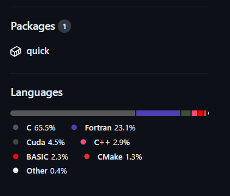

.. include:: quick_docs_common.rst

Developer Guide
===============

QUICK API
---------

.. image:: api.png
    :width: 680px
    :align: center
    :height: 294px
    :alt: api

Starting from version 20.06, the QUICK build system compiles the source code and creates static or
shared object libraries. Such libraries are then linked to the main QUICK program. Assuming that a
user specifies a prefix (*$installdir*) during the configuration of legacy or CMake builds, libraries will be located inside
*$installdir/lib*.

In the case of the **legacy build system**, there will be subdirectories *$installdir/lib/$buildtype* where *buildtype* could be *serial*, *mpi* or *cuda*. Required .mod or 
header files can be found inside *$QUICK_HOME/include/$buildtype*.

In the case of the **CMake build system** the libraries will be in directory *$installdir/lib*. Depending on the type of build, there will be the serial library *libquick.so* and any of CUDA and MPI enabled libraries *libquick_cuda.so*, *libquick_mpi.so*, and *libquick_mpi_cuda.so*. The corresponding module files are located in build type specific subdirectories of *$installdir/include/libxc* and *$installdir/include/quick*. 

It is possible to link QUICK libraries into external programs to obtain HF/DFT energies, gradients
and point charge gradients through the Fortran 90 QUICK API. This is useful for example for MM programs to perform QM/MM calculations. We will explain the usage of the API
with an example.

Let us consider a simple system containing a water molecule surrounded by 3 point charges. We now create the
following fortran module (test_module.f90) and store atomic coordinates and charges for 5 snapshots. Furthermore, we implement
several subroutines to load test data and print data retrieved from QUICK.

::

	! Test module for QUICK API
	module test_quick_api_module
	
	  implicit none
	  private
	
	  public :: loadTestData, printQuickOutput
	
	#ifdef MPIV
	  public :: mpi_initialize, printQuickMPIOutput, mpi_exit
	#endif
	
	  ! A test system with one water molecule and 3 point charges.
	  ! Atomic coordinates, external point charges and their coordinates
	  ! for five snapshots. 
	  double precision, dimension(1:45) :: all_coords
	  double precision, dimension(1:60) :: all_extchg
	
	  data all_coords &
	  /-0.778803, 0.000000, 1.132683, &
	   -0.666682, 0.764099, 1.706291, &
	   -0.666682,-0.764099, 1.706290, &
	   -0.678803, 0.000008, 1.232683, &
	   -0.724864, 0.755998, 1.606291, &
	   -0.724862,-0.756005, 1.606290, &
	   -0.714430, 0.000003, 1.267497, &
	   -0.687724, 0.761169, 1.624424, &
	   -0.687723,-0.761172, 1.624427, &
	   -0.771504, 0.000000, 1.167497, &
	   -0.669068, 0.763767, 1.697008, &
	   -0.669068,-0.763767, 1.697008, &
	   -0.771372, 0.000000, 1.162784, &
	   -0.668845, 0.767538, 1.698983, &
	   -0.668845,-0.767538, 1.698982/
	
	    data all_extchg &
	  /1.6492, 0.0000,-2.3560, -0.8340, &
	   0.5448, 0.0000,-3.8000,  0.4170, &
	   0.5448, 0.0000,-0.9121,  0.4170, &
	   1.6492, 0.0000,-2.3560, -0.8360, &
	   0.5448, 0.0000,-3.8000,  0.4160, &
	   0.5448, 0.0000,-0.9121,  0.4160, &
	   1.6492, 0.0000,-2.3560, -0.8380, &
	   0.5448, 0.0000,-3.8000,  0.4150, &
	   0.5448, 0.0000,-0.9121,  0.4150, &
	   1.6492, 0.0000,-2.3560, -0.8400, &
	   0.5448, 0.0000,-3.8000,  0.4140, &
	   0.5448, 0.0000,-0.9121,  0.4140, &
	   1.6492, 0.0000,-2.3560, -0.8420, &
	   0.5448, 0.0000,-3.8000,  0.4130, &
	   0.5448, 0.0000,-0.9121,  0.4130/
	
	   ! number of point charges per frame
	   integer :: nptg_pframe = 3
	
	  interface loadTestData
	    module procedure load_test_data
	  end interface loadTestData
	
	contains
	
	  subroutine load_test_data(frame, natoms, nxt_charges, coord, xc_coord)
	
	    implicit none
	
	    integer, intent(in)             :: frame, natoms, nxt_charges
	    double precision, intent(inout) :: coord(3, natoms)
	    double precision, intent(out)   :: xc_coord(4, nxt_charges)
	    integer :: i, j, k
	
	    k=natoms*3*(frame-1) + 1
	    do i=1,natoms
	      do j=1,3
	        coord(j,i) = all_coords(k)
	        k=k+1
	      enddo
	    enddo
	
	    if(nxt_charges>0) then
	      k=nptg_pframe*4*(frame-1) + 1
	      do i=1,nxt_charges
	        do j=1,4
	          xc_coord(j,i) = all_extchg(k)
	          k=k+1
	        enddo
	      enddo
	    endif
	
	  end subroutine load_test_data
	
	#ifdef MPIV
	  ! Initialize mpi library and save mpirank and mpisize.
	  subroutine mpi_initialize(mpisize, mpirank, master, mpierror)
	
	    implicit none
	
	    integer, intent(inout) :: mpisize, mpirank, mpierror
	    logical, intent(inout) :: master
	
	    include 'mpif.h'
	
	    call MPI_INIT(mpierror)
	    call MPI_COMM_RANK(MPI_COMM_WORLD,mpirank,mpierror)
	    call MPI_COMM_SIZE(MPI_COMM_WORLD,mpisize,mpierror)
	    call MPI_BARRIER(MPI_COMM_WORLD,mpierror)
	
	    if(mpirank .eq. 0) then
	      master = .true.
	    else
	      master = .false.
	    endif
	
	  end subroutine mpi_initialize
	
	  ! Prints mpi output sequentially.
	  subroutine printQuickMPIOutput(natoms, nxt_charges, atomic_numbers, &
	    totEne, gradients, ptchg_grad, mpirank)
	
	    implicit none
	
	    integer, intent(in)          :: natoms, nxt_charges, mpirank
	    integer, intent(in)          :: atomic_numbers(natoms)
	    double precision, intent(in) :: totEne
	    double precision, intent(in) :: gradients(3,natoms)
	    double precision, intent(in) :: ptchg_grad(3,nxt_charges)
	
	    write(*,*) ""
	    write(*,'(A11, 1X, I3, 1x, A3)') "--- MPIRANK", mpirank, "---"
	    write(*,*) ""
	
	    call printQuickOutput(natoms, nxt_charges, atomic_numbers, totEne, &
	    gradients, ptchg_grad)
	
	  end subroutine printQuickMPIOutput
	
	  subroutine mpi_exit
	
	    implicit none
	    integer :: mpierror
	
	    include 'mpif.h'
	
	    call MPI_FINALIZE(mpierror)
	    call exit(0)
	
	  end subroutine mpi_exit
	
	#endif
	
	
	  subroutine printQuickOutput(natoms, nxt_charges, atomic_numbers, totEne, &
	    gradients, ptchg_grad)
	
	    implicit none
	
	    integer, intent(in)          :: natoms, nxt_charges
	    integer, intent(in)          :: atomic_numbers(natoms)
	    double precision, intent(in) :: totEne
	    double precision, intent(in) :: gradients(3,natoms)
	    double precision, intent(in) :: ptchg_grad(3,nxt_charges)
	    integer :: i, j
	
	    ! Print energy  
	    write(*,*) ""
	    write(*,*) "*** TESTING QUICK API ***"
	    write(*,*) ""
	    write(*,*) "PRINTING ENERGY"
	    write(*,*) "---------------"
	    write(*,*) ""
	    write(*, '(A14, 3x, F14.10, 1x, A4)') "TOTAL ENERGY =",totEne,"A.U."
	
	    ! Print gradients
	    write(*,*) ""
	    write(*,*) "PRINTING GRADIENTS"
	    write(*,*) "------------------"
	    write(*,*) ""
	    write(*, '(A14, 3x, A6, 10x, A6, 10x, A6)') "ATOMIC NUMBER","GRAD-X","GRAD-Y","GRAD-Z"
	
	    do i=1,natoms
	      write(*,'(6x, I5, 2x, F14.10, 2x, F14.10, 2x, F14.10)') atomic_numbers(i), &
	      gradients(1,i), gradients(2,i), gradients(3,i)
	    enddo
	
	    ! Print point charge gradients
	    if(nxt_charges>0) then
	      write(*,*) ""
	      write(*,*) "PRINTING POINT CHARGE GRADIENTS"
	      write(*,*) "-------------------------------"
	      write(*,*) ""
	      write(*, '(A14, 3x, A6, 10x, A6, 10x, A6)') "CHARGE NUMBER","GRAD-X","GRAD-Y","GRAD-Z"
	
	      do i=1,nxt_charges
	        write(*,'(6x, I5, 2x, F14.10, 2x, F14.10, 2x, F14.10)') i, ptchg_grad(1,i), &
	        ptchg_grad(2,i), ptchg_grad(3,i)
	      enddo
	    endif
	
	    write(*,*) ""
	
	  end subroutine printQuickOutput
	
	end module

Next, we implement the following example program (example.f90) that uses the above module and calls QUICK through the API.

::

	! Program for testing QUICK API
	program test_quick_api
	
	    use test_quick_api_module, only : loadTestData, printQuickOutput
	    use quick_api_module, only : setQuickJob, getQuickEnergy, &
	    getQuickEnergyGradients, deleteQuickJob 
	    use quick_exception_module
	#ifdef MPIV
	    use test_quick_api_module, only : mpi_initialize, printQuickMPIOutput, mpi_exit
	    use quick_api_module, only : setQuickMPI
	#endif
	
	    implicit none
	
	#ifdef MPIV
	    include 'mpif.h'
	#endif
	
	    ! i, j are some integers useful for loops, frames is the number of
	    ! test snapshots (md steps), ierr is for error handling
	    integer :: i, j, frames, ierr
	   
	    ! number of atoms, number of external point charges, flag to specify whether
            ! density matrix should be reused in MD 
	    integer :: natoms, nxt_charges, reuse_dmx
	
	    ! atom type ids, atomic numbers, atomic coordinates, point charges and
	    !  coordinates
	    integer, allocatable, dimension(:)            :: atomic_numbers 
	    double precision, allocatable, dimension(:,:) :: coord          
	    double precision, allocatable, dimension(:,:) :: xc_coord       
	
	    ! name of the quick template input file
	    character(len=80) :: fname
	
	    ! job card
	    character(len=200) :: keywd
	
	    ! total qm energy, mulliken charges, gradients and point charge gradients
	    double precision :: totEne
	    double precision, allocatable, dimension(:,:) :: gradients         
	    double precision, allocatable, dimension(:,:) :: ptchgGrad      
	
	#ifdef MPIV
	    ! essential mpi information 
	    integer :: mpierror = 0
	    integer :: mpirank  = 0
	    integer :: mpisize  = 1
	    logical :: master   = .true.

	    ! Initialize mpi library and get mpirank, mpisize
	    call mpi_initialize(mpisize, mpirank, master, mpierror)
	
	    ! Setup quick mpi using api, called only once
	    call setQuickMPI(mpirank,mpisize,ierr)
	#endif
	
	    ! Set molecule size. We consider a water molecule surounded by 3 point
	    ! charges in this test case. 
	    natoms      = 3
	    nxt_charges = 3    
	
	    ! We consider 5 snapshots of this test system (mimics 5 md steps). 
	    frames = 5
	
	    ! Alocate memory for some input and output arrays. 
	    if ( .not. allocated(atomic_numbers)) allocate(atomic_numbers(natoms), stat=ierr) 
	    if ( .not. allocated(coord))          allocate(coord(3,natoms), stat=ierr)
	    if ( .not. allocated(gradients))         allocate(gradients(3,natoms), stat=ierr)
	
	    ! Fill up memory with test values, coordinates and external charges will be loded inside 
	    ! the loop below.
	    fname           = 'api_water_rhf_631g'
	    keywd           = 'HF BASIS=6-31G CUTOFF=1.0D-10 DENSERMS=1.0D-6 GRADIENT EXTCHARGES'
	    !keywd =''
	
	    atomic_numbers(1)  = 8
	    atomic_numbers(2)  = 1
	    atomic_numbers(3)  = 1
	
	    ! Set the gradient vector to zero.
	    gradients    = 0.0d0

            ! Set to reuse density matrix in MD.
            reuse_dmx = 1

	    ! Initialize QUICK, required only once. Assumes keywords for
	    ! the QUICK job are provided through a template file.  
	    call setQuickJob(fname, keywd, natoms, atomic_numbers, reuse_dmx, ierr)
	
	    do i=1, frames
	      ! Actual QM/MM simulations may have different number of point charges during MD.
	      ! Use this trick to mimic this & load coordinates and external point charges for ith step.
	      nxt_charges = mod(i,4)
	
	      ! Allocate memory for xyz coordinates of the point charges and gradients. 
	      ! Note that in xc_coord array, the first 3 columns are the xyz coordinates 
	      ! of the point charges and fourth column is the charge.

	      if ( .not. allocated(xc_coord)) allocate(xc_coord(4,nxt_charges), stat=ierr)      
	      if ( .not. allocated(ptchgGrad)) allocate(ptchgGrad(3,nxt_charges), stat=ierr)

	      ! Set the point charge gradient vector to zero.
	      ptchgGrad = 0.0d0	

	      ! Load test data.
	      call loadTestData(i, natoms, nxt_charges, coord, xc_coord) 
	
	      ! Compute required quantities, call only a or b. 
	      ! a. compute energy
	      ! call getQuickEnergy(coord, nxt_charges, xc_coord, totEne)
	
	      ! b. Compute energies, gradients and point charge gradients
	      call getQuickEnergyGradients(coord, nxt_charges, xc_coord, &
	         totEne, gradients, ptchgGrad, ierr)    
	
	      ! Print values obtained from quick library.
	#ifdef MPIV
	      ! Dumb way to sequantially print from all cores.
	      call MPI_BARRIER(MPI_COMM_WORLD,mpierror)
	
	      do j=0, mpisize-1
	        if(j .eq. mpirank) then
	          call printQuickMPIOutput(natoms, nxt_charges, atomic_numbers, totEne, &
		  gradients, ptchgGrad, mpirank)
	        endif
	        call MPI_BARRIER(MPI_COMM_WORLD,mpierror)
	      enddo 
	#else
	      call printQuickOutput(natoms, nxt_charges, atomic_numbers, totEne, gradients, ptchgGrad)
	#endif
	
	      ! Deallocate memory of point charge stuff.
	      if ( allocated(xc_coord))       deallocate(xc_coord, stat=ierr)
	      if ( allocated(ptchgGrad))      deallocate(ptchgGrad, stat=ierr)
	    enddo
	
	    ! Finalize QUICK, required only once.
	    call deleteQuickJob(ierr)
	
	    ! Deallocate memory.
	    if ( allocated(atomic_numbers)) deallocate(atomic_numbers, stat=ierr)
	    if ( allocated(coord))          deallocate(coord, stat=ierr)
	    if ( allocated(gradients))         deallocate(gradients, stat=ierr)
	
	#ifdef MPIV
	   call mpi_exit
	#endif
	
	end program test_quick_api

Note that in our test program, errors are propagated from QUICK using *ierr* integer variable. 
The errors must be properly handled although we have not shown error handling here. 
Assuming we configured QUICK serial version with a prefix and compiled using intel compiler toolchain,we can 
compile above source files and link QUICK libraries as follows.

::

	ifort -cpp test_module.f90 example_program.f90 -o example_program -I$installdir/include/serial/
	-L$installdir/lib/serial/ -lquick -lblas-quick -lxc -lstdc++

MPI version of the libraries can be linked as follows.

::

	mpiifort -cpp -DMPIV test_module.f90 example_program.f90 -o example_program 
	-I$installdir/include/mpi/ -L$installdir/lib/mpi/ -lquick-mpi -lblas-quick -lxc -lstdc++

CUDA version of the libraries can be linked as follows.

::

	ifort -cpp test_module.f90 example_program.f90 -o example_program -I$installdir/include/cuda/
	-L$installdir/lib/cuda/ -L$CUDA_HOME/lib64 -lcuda -lm -lcudart -lcublas -lcusolver 
	-lquick-cuda -lxc-cuda -lstdc++

CUDAMPI version of the libraries can be linked as follows.

::

	mpiifort -cpp -DMPIV test_module.f90 example_program.f90 -o example_program 
	-I$installdir/include/cuda/ -L$installdir/lib/cuda/ -L$CUDA_HOME/lib64 -lcuda -lm -lcudart 
	-lcublas -lcusolver -lquick-cudampi -lxc-cuda -lstdc++

Running serial or CUDA executable should produce `this output <https://raw.githubusercontent.com/merzlab/QUICK-docs/master/resources/v21.03/api-serial.txt>`_.
A `similar output <https://raw.githubusercontent.com/merzlab/QUICK-docs/master/resources/v21.03/api-mpi.txt>`_ may be obtained by running MPI or CUDAMPI version with 2 processes.

Adding new basis sets
---------------------

QUICK follows the basis set format established by the *Gaussian* software. You have to follow this format if you want to construct your own basis set. Established basis sets can be obtained from the `basis set exchange web page <https://www.basissetexchange.org/>`_. In order to add a basis set into QUICK, one should download the basis set in the *Gaussian* software format and save it in the *basis* folder. Then, link this basis set to QUICK by updating the *basis_link* file inside the *basis* folder. The *basis_link* file contains a table in the following format.

.. code-block:: none

 ___________________________________________________________________________ 
 | Keyword                           | Filename                            |
 |-------------------------------------------------------------------------|
 | #STO-3G                           | STO-3G.BAS                          |
 | #3-21G                            | 3-21G.BAS                           |
 | #6-31G                            | 6-31G.BAS                           |
 | #6-31G*                           | 6-31GS.BAS                          |
 | #6-31G**                          | 6-31GSS.BAS                         |
 | #6-311G                           | 6-311G.BAS                          |
 | #6-311G(d,p)                      | 6-311GDP.BAS                        |
 | #6-311G*                          | 6-311GS.BAS                         |
 | #6-311G**                         | 6-311GSS.BAS                        |
 | #cc-pVDZ                          | CC-PVDZ.BAS                         |
 | #cc-pVTZ                          | CC-PVTZ.BAS                         |
 |_________________________________________________________________________|    
         
You should update this table by adhering to the rules below.

 1. Add a keyword for your basis set. This must be followed by a single space and '#' character.

 2. Keyword size must be less than 32 characters.

 3. Filename must start at 24th position of the line and must not be longer than 36 characters.

 4. DO NOT CHANGE THE TABLE/COLUMN WIDTH! VERTICAL BORDERS MUST REMAIN THE SAME.

Note 1: Current version of QUICK ERI engine only support basis functions up to *d*. Therefore, do not add high angular momentum basis sets and attempt to use f/g functions.

Note 2: ECPs are not supported by |QUICK_VERSION|. Therefore care must be taken not to add elements that require ECPs as this would lead to wrong results.

Adding new test cases into test suite
-------------------------------------

In order to add new test cases into the QUICK test suite, one must follow 3 steps. First, the test input and reference output file
should be added into $QUICK_HOME/test and $QUICK_HOME/test/saved directories respectively. Make sure to adhere to following naming
convention. 

.. code-block:: none

 <calculation_type>_<molecule_name>_<QM_method>_<basis_set>.<in|out>

Some example test case names that follow this convention are shown below.

.. code-block:: none

 ene_NH4_rhf_631g.in, ene_NH4_rhf_631g.out
 grad_CH4_b3lyp_def2svp.in, grad_CH4_b3lyp_def2svp.out
 opt_wat_rhf_631g.in, opt_wat_rhf_631g.out

Second, test list files located inside $QUICK_HOME/test should be updated. These are just .txt files that record names of test cases. 
Currently, there are 4 testlist files: testlist_short.txt, testlist_short_cuda.txt, testlist_full.txt, testlist_full_cuda.txt.
The first and second contain short test lists that would be used for standard testing (i.e. by executing *make test* or *./runtest* commands) 
of quick/quick.MPI and quick.cuda/quick.cuda.MPI executables. The third and fourth are used for robust testing (i.e. by executing *make fulltest* 
or *./runtest - -full* commands) which usually happens during CI. 
They have the following format:

.. code-block:: none

 ene_wat2_mp2_631g                 #MP2 test with s and p basis functions
 ene_wat2_mp2_631gss               #MP2 test with s, p and d basis functions
 grad_psb3_b3lyp_631g              #B3LYP gradient test with s and p basis functions
 grad_NaCl_b3lyp_def2svp           #B3LYP gradient test with s, p and d basis functions
 grad_wat_b3lyp_ccpvdz             #B3LYP point charge gradient test
 opt_wat_rhf_631g                  #RHF geometry optimization test with s and p basis functions

Third, the runtest script located in $QUICK_HOME/tools should be updated with test information. Specifically, *print_test_info()* function of the 
script contains a case statement that sets a string variable value which will be printed during the test runs. 

.. code-block:: none

 print_test_info(){
      .
      .
      .
  case "$t" in
    ene_AlH3_rhf_sto3g)                   testinfo="ALH3: RHF energy test: STO-3G basis set";;
    ene_BeH2_rhf_sto3g)                   testinfo="BeH2: RHF energy test: STO-3G basis set";;
    ene_BH3_rhf_sto3g)                    testinfo="BH3: RHF energy test: STO-3G basis set";;

You should add the new test name as a case and store test information in *testinfo* variable. Finally, when you add changes using git, make sure to
use *git add -f* command for adding the reference output files. This is due to the fact that files with .out extension are ignored by git according
to .gitignore rules.

Maintaining the documentation
-----------------------------

This section provides some guidence to keep this documentation alive and up to date when the current doc keeper is gone.

The documentation is written
in the rst language and you must be familiar with the syntax before starting. A short and sweet rst lesson can be found `here <https://thomas-cokelaer.info/tutorials/sphinx/rest_syntax.html>`_.

When you are ready, clone the documentation from `GitHub repository <https://github.com/merzlab/QUICK-docs>`_.

In the root QUICK-docs directory (from now on $QUICK_DOCS), you should find two directories called *docs* and *resources*. Inside the *docs* directory, a Makefile and 
*source* directory should exist. The latter contains all the documentation source and images that would go in. If you have large text files to be included, these should be saved
in $QUICK_DOCS/resources inside an appropriate directory and linked properly. Setting the QUICK version appearing in the documentation is achieved by assigning a value to the *QUICK_VERSION* variable in $QUICK_DOCS/docs/source/quick_docs_common.rst file. For a release version, we will have to set this to a proper string value (eg. QUICK-23.03).
Once you have made changes, also make sure to change the QUICK version (i.e. set *version* variable, semantic versioning must be used) in $QUICK_DOCS/docs/source/conf.py and compile the documentation using Make. In order to do so, you must have installed *sphinx* and *python* in your system. If the *sphix-build* executable is not accessible through your path variable, make sure to set the *SPHINXBUILD* variable in $QUICK_DOCS/docs/Makefile. Then from $QUICK_DOCS/docs folder, execute the following command.

.. code-block:: none

 cd $QUICK_DOCS/docs
 make html

This should compile the documentation. Once the compilation is done, open up the documentation and check your changes. This may be done as follows.

.. code-block:: none

 open $QUICK_DOCS/docs/build/html/index.html 

If you are happy with the changes, push/merge the new content into `GitHub repository <https://github.com/merzlab/QUICK-docs>`_. 

The QUICK-docs GitHub repository is linked to readthedocs.org web portal where the documentation is compiled and hosted. Log into merzlab account of the readthedocs.org web portal
using appropriate username and password. You should find the following QUICK-docs project page once landed inside the account. 

.. image:: readthedocs1.png
    :width: 650px
    :align: center
    :height: 498px
    :alt: support

Note that we have different documentation versions in versions in the panel. The *latest* version is a compilation of the most recent source from the QUICK-docs repository. The other versions correspond to different QUICK release versions.

To create such a version, you must create a GitHub tag that points to a specific commit of the QUICK-docs repository. More details on creating a GitHub tag can be found in the GitHub documentation. Once the tag is created, you can select this tag and create a new documentation version from the *versions* page of the readthedocs web portal. Note that when creating the GitHub tag, you must name it following semantic versioning. Otherwise, the tag wont appear in the readthedocs web portal. Next, build the documentation by simply hitting the *Build Version* button of the *build* page. Once the documentation is built, this will appear online.

You can link the html pages of a particular documentation version anywhere you want. For example, we can link the installation guide of the documentation into the README.md file of QUICK repository. 

.. code-block:: none

 * [Installation Guide](https://quick-docs.readthedocs.io/en/21.3.0/installation-guide.html#installation-guide)

Note that above we link a page from documentation version *21.3.0* into the QUICK-21.03 README.md file. Similarly, a status badge from a particular version can be included in the README.md file.

Note that you should never link anything from the documentation version named *latest*. This version will change whenever you make changes to the QUICK-docs repository and thus must be used for testing purposes only.        

Maintaining the container
-------------------------
This section provides some guidance on keeping the QUICK container up to date.

This section assumes that you are familiar with GitHub Actions and Docker containers.
If you are not familiar with both, it is highly recommended that you watch the below videos:

* `30-minute lesson on GitHub Actions <https://www.youtube.com/watch?v=R8_veQiYBjI>`_
* `1-hour lesson on Docker <https://www.youtube.com/watch?v=pg19Z8LL06w>`_

In addition to those short lessons, the official documentation for each is below:

* `GitHub Actions Docs <https://docs.github.com/en/actions>`_
* `Docker Docs <https://docs.docker.com/>`_

Updating the Dockerfile
^^^^^^^^^^^^^^^^^^^^^^^
The Dockerfile may require updates from time to time.
Reasons for updating the Dockerfile could include: updating the CUDA base image, adding a build target for ROCm or accounting for changes in compilation & configuration of QUICK.

The below description considers the Dockerfile as originally authored, provided below:

.. code-block:: none
	:linenos:

	############################
	### Base MPI CUDA 12.0.1 ###
	############################
	FROM nvidia/cuda:12.0.1-devel-ubuntu22.04 AS base-mpi-cuda-12.0.1

	RUN apt-get update -y \
	&& apt-get install -y \
		gfortran \
		cmake \
		g++ \
		openmpi-bin \
		openmpi-common \
		libopenmpi-dev

	RUN mkdir /src \
	&& mkdir /src/build

	WORKDIR /src

	# Copy the current version of QUICK into the container
	COPY . .

	WORKDIR /src/build

	RUN cmake .. -DCOMPILER=GNU -DCMAKE_INSTALL_PREFIX=$(pwd)/../install -DCUDA=TRUE -DMPI=TRUE

	RUN make -j2 install

	#############################
	## Runtime MPI CUDA 12.0.1 ##
	#############################

	# Runtime image is smaller than the devel/build image
	FROM nvidia/cuda:12.0.1-runtime-ubuntu22.04 AS mpi-cuda-12.0.1

	RUN apt-get update -y \
	&& apt-get install -y \
		openmpi-bin \
		openmpi-common \
		libopenmpi-dev

	# Copy the compiled quick runtimes, leaving behind extra build dependencies & reducing image size
	COPY --from=base-mpi-cuda-12.0.1 /src /src

	WORKDIR /src/install

	# Manually run steps from quick.rc
	ENV QUICK_INSTALL /src/install
	ENV QUICK_BASIS $QUICK_INSTALL/basis
	ENV PATH $PATH:$QUICK_INSTALL/bin

Beginning with line 4, we can see that the base image chosen is "nvidia/cuda:12.0.1-devel-ubuntu22.04" which is aliased as "base-mpi-cuda-12.0.1".
The aliases serve as a shorthand reference inside this Dockerfile, as well as to the Docker build process where these can be specified as build targets.
From the tag ":12.0.1-devel-ubuntu22.04" we can infer that this image is itself based on Ubuntu version 22.04 and that it comes with CUDA version 12.0.1 pre-installed.

Similarly on line 34, we see an additional image of "nvidia/cuda:12.0.1-runtime-ubuntu22.04" aliased as "mpi-cuda-12.0.1".
The main difference between these two images is the amount of software they have pre-installed. 
This translates to their overall file size with the development image having a size of nearly 3.5 GB and the runtime image having a size of nearly 1.25 GB.
A smaller image size is preferrable, as it takes less storage for the end-user as well as less time to download.

Both images are fetched from the `Docker Hub <https://hub.docker.com/>`_, specifically the repository `nvidia/cuda <https://hub.docker.com/r/nvidia/cuda>`_.
Both of these images will require an update in the future to support the latest version of CUDA.  
When released, newer versions of these container images can be found on the tags section of the nvida/cuda repo.
These future versions should then be replaced in the Dockerfile.

Next we consider lines 6-13 and 36-40. We can see additional dependencies being installed for the development and runtime images, respectively.
These are packages required for building and running QUICK that are not included in the respective images.
When additional build and runtime dependencies are added for QUICK these sections should be updated to install those dependencies.

Continuing with lines 15-27, we can see linux commands being executed according to the directions for compiling QUICK.
When the steps for compiling QUICK change, this section should be updated to match.

Next on line 43, we see that we copy the /src directory from the development image to the runtime image.
At this point in the process the /src directory has all of the built binaries for QUICK.
This step is critical as it is resposible for drastically reducing the final (runtime) image size from >= 3.5 GB to >= 1.25 GB by leaving behind all of the extra software in the development build.
When the development alias is updated, this line should be updated to match.

Finally, we see on lines 47-50 that the steps outlined in the quick.rc are performed. 
These steps must be executed here so that these environment variables are automatically available to the user each time they run the container.
As steps are added to the quick.rc, they should be added here as well.

Manual builds with Docker
^^^^^^^^^^^^^^^^^^^^^^^^^
When making changes to QUICK or the Dockerfile, you can manually build the image to test your changes. 
These steps will require that you have an installation of Docker and familiarity with a linux terminal.
These examples assume that you have a `Docker Hub <https://hub.docker.com/>`_ account and that you have QUICK cloned on your computer, referenced as $QUICK_PATH in the examples below.
These examples will reference the Dockerfile discussed above.

We will cover a few options for building the image: building all stages, building a specific stage, and building without the cache.
Stages, in the context of Docker, means any section of the Dockerfile that begins with the "FROM" keyword until the next instance of "FROM" or the end of the file, whichever comes first.
More can be learned on this subject from the `Docker docs on multi-stage builds <https://docs.docker.com/build/building/multi-stage/>`_.

Building all stages
"""""""""""""""""""
We will start with building all stages, as that is typically the default build choice. 
When you build all stages, the last stage in the Dockerfile becomes the final image.

Begin by navigating to your clone of the QUICK repository:

.. code-block:: none

	cd $QUICK_PATH

To build all stages, run this command from $QUICK_PATH, where the Dockerfile exists:

.. code-block:: none

	docker build -f Dockerfile -t [your-dockerhub-username]/quick:[your-tag] .

**Note**: You should replace the brackets and contents with your username and your choice of the tag.

The build process will take several minutes. When it has finished successfully, you can find the image with this command:

.. code-block:: none

	docker image ls | grep "quick"

Assuming the container built successfully, you can then run the container:

.. code-block:: none

	docker run --rm -it [your-dockerhub-username]/quick:[your-tag] /bin/bash

When you are done testing the container, you can exit the container:

.. code-block:: none

	exit

Building a specific stage
"""""""""""""""""""""""""
This build option is useful when you only need to change something in one stage of the container, for instance installing new runtime dependencies in the runtime stage.
Building just one stage can save you quite a bit of build time, assuming that you have previously built its dependent stages.
In the Dockerfile discussed previously, the runtime stage has a dependency on the base stage, as it copies files from the base stage.

Begin by navigating to your clone of the QUICK repository:

.. code-block:: none

	cd $QUICK_PATH

You can then specify that Docker should only build the stage that you want:

.. code-block:: none

	docker build -f Dockerfile --target [stage] -t [your-dockerhub-username]/quick:[your-tag] .

**Note**: You should replace the stage and brackets with an alias from the Dockerfile, for example "mpi-cuda-12.0.1".

Assuming the container built successfully, you can then run the container:

.. code-block:: none

	docker run --rm -it [your-dockerhub-username]/quick:[your-tag] /bin/bash

When you are done testing the container, you can exit the container:

.. code-block:: none

	exit

Building without the cache
"""""""""""""""""""""""""""
Lastly, you can force Docker to build a container image without using its cache.
By default, Docker will keep a cache of the layers in a Dockerfile and will only build layers that have been changed or that have a dependency on a changed layer.
You will want to build without the cache when changing things that get copied into the container image, such as the source code for QUICK.

For example, if you were to change some of the source code, but you don't have to update the Dockerfile in any way, Docker will not know to rebuild the layer and you could find that the container does not reflect your latest changes.
Building without the cache will force Docker to build the entire Dockerfile, which will take longer, but it will catch any changes made outside the Dockerfile.

Begin by navigating to your clone of the QUICK repository:

.. code-block:: none

	cd $QUICK_PATH

You can then specify that Docker should build the entire Dockerfile without the cache:

.. code-block:: none

	docker build -f Dockerfile --no-cache -t [your-dockerhub-username]/quick:[your-tag] .

Assuming the container built successfully, you can then run the container:

.. code-block:: none

	docker run --rm -it [your-dockerhub-username]/quick:[your-tag] /bin/bash

When you are done testing the container, you can exit the container:

.. code-block:: none

	exit

Automated builds with GitHub Actions
^^^^^^^^^^^^^^^^^^^^^^^^^^^^^^^^^^^^
The QUICK container should automatically be built and published by the GitHub Actions worfklow "Docker," which is defined in the `GitHub repository <https://github.com/merzlab/QUICK>`_ at the path .github/workflows/docker-publish.yml.
Runs of this GitHub Action can be found in the repository on the "Actions" tab under the name "Docker."
This workflow is triggered upon pushes and pull requests to the master branch as well as when releases are published.
The workflow builds the Dockerfile located in the root of the repository.
When this workflow runs successfully, the newly built container image can be found on the repository homepage under the packages tab on the right:

Clicking "quick" will take you to the page for the container and display the most recent version, as well as other versions:

From time to time, it may be necessary to update the versions of the steps in the workflow.
When doing so, it is important to leave the first step "Convert IMAGE_NAME to lowercase" in the workflow. 
This step conforms the image name, initially "QUICK", to lowercase which is required by Docker for image names.

Beginning with the second step "Checkout repository", other steps in the workflow will have versions ranging from "@vX" to "@x.x.x" or "@XXXXXXXXXXXXXXX".
For example, at the time of writing, the second step is "actions/checkout@v3".
The step name is in the form of "[author]/[action name][version]".
To update an action, visit the `GitHub Marketplace for actions <https://github.com/marketplace?category=&query=&type=actions>`_ and enter the name of the action into the search bar.
For example, if we needed to update the second step, we would search the action name of "checkout" and look for the author "actions."

Clicking into that first result will take us to the `action's page <https://github.com/marketplace/actions/checkout>`_ which will have instructions for using the latest version.
You can then update the version as appropriate in the workflow definition file at the path .github/workflows/docker-publish.yml.

*Last updated by Kyle Krick on 02/05/2024.*
