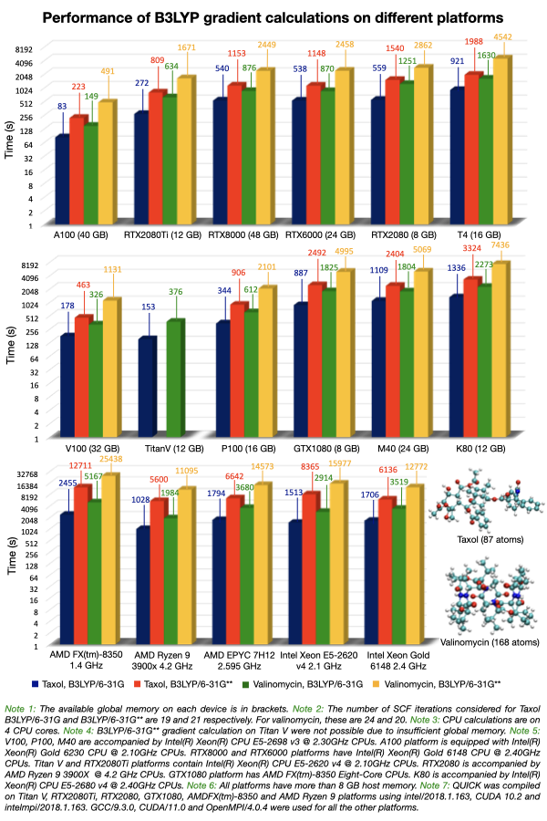
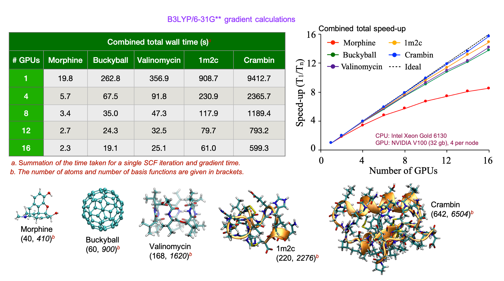

Accuracy and Performance
========================

The data reported in this section is solely intended for informative purpose.

These were obtained using QUICK-21.03. The code is continuously being
improved. QUICK-23.08 is over three times faster than QUICK-20.03 and
about 2.5 times as fast as QUICK-21.03.

Readers shall not use the data presented here for comparison with other quantum
chemical codes. If you are interested in doing so, we highly encourage you to
download the latest QUICK version, compile, and perform your own benchmarks.

Accuracy of energies and gradients
^^^^^^^^^^^^^^^^^^^^^^^^^^^^^^^^^^

We have compared energies and gradients computed by QUICK with values computed
by other quantum chemical packages. HF energies and gradients have displayed
accuracies of 1.0E-6 Hartree and 1.0E-4 Hartree/Bohr or better,
respectively, for test systems (see `https://github.com/merzlab/QUICK-tests
<https://github.com/merzlab/QUICK-tests>`_ for test cases). DFT energies and
gradients have shown similar accuracies in most cases, however, we have
observed larger deviations for some molecular systems. Such deviations usually
arise due to differences in the exchange correlation quadrature grid.

Performance of QUICK CUDA single GPU and MPI parallel versions
^^^^^^^^^^^^^^^^^^^^^^^^^^^^^^^^^^^^^^^^^^^^^^^^^^^^^^^^^^^^^^

**Benchmark data obtained with QUICK-21.03**. The code is continuously
being improved. **QUICK-23.08 is about 2.5 times faster**.

The following graph gives an idea about the performance for a single point SCF +
gradient calculation that can be expected with **QUICK-21.03** for a relatively large
molecule and reasonably sized basis set.  We have used **conservative SCF
convergence criteria and integral thresholds**.  With these settings, **a
B3LYP/6-31G\*\* SCF + gradient calculation of valinomycin (168 atoms) takes
only about 8 minutes** on a modern A100 GPU. Real world applications
typically require less stringent accuracy and thus require less time to
solution. Performance on gaming GPUs is also excellent given their price
point.

Performance of QUICK MPI+CUDA version
^^^^^^^^^^^^^^^^^^^^^^^^^^^^^^^^^^^^^
The distributed multi-GPU implementation of QUICK utilizes the Message Passing
Interface (MPI). In particular for larger calculations the code shows excellent
scalability, and thus it makes sense to perform calculations with multiple GPUs
if time-to-solution is of importance.  **A B3LYP/6-31G\*\* single point SCF +
gradient calculation for the entire Crambin protein (642 atoms) can be
performed in under 10 minutes using QUICK-21.03** on 16 V100 GPUs.

See the following paper for more benchmarks of QUICK multi-GPU version:
`Manathunga, M.; Jin, C; Cruzeiro, V.W.D.; Miao, Y.; Mu, D.; Arumugam, K.;
Keipert, K.; Aktulga, H.M.; Merz, K.M.; Götz, A.W. Harnessing the Power of
Multi-GPU Acceleration into the Quantum Interaction Computational Kernel
Program, J. Chem. Theory Comput. 2021, 17, 7, 3955–3966.
<https://pubs.acs.org/doi/abs/10.1021/acs.jctc.1c00145>`_.

*Last updated by Andreas Goetz on 04/25/2024.*
