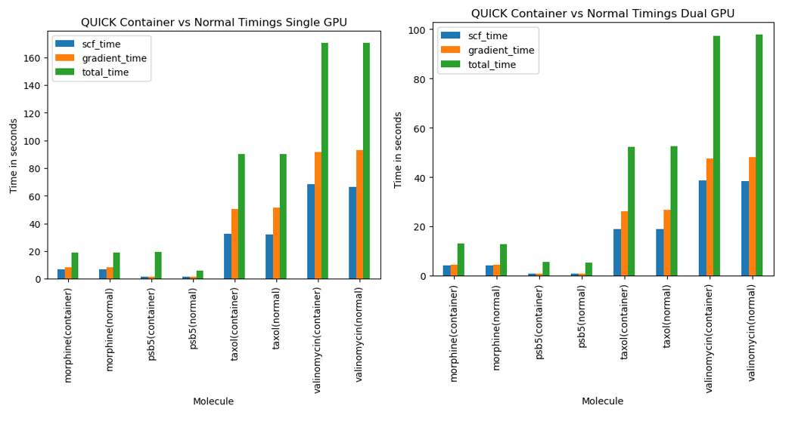
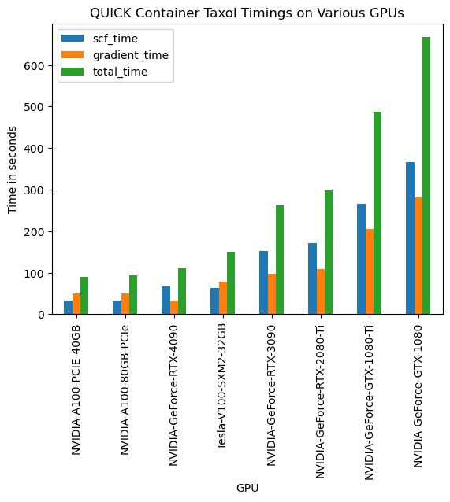

Accuracy and Performance
========================

The data reported in this section is solely intended for informative purpose. These were obtained using QUICK-21.03. The code is continuously being improved. Readers shall not use the data presented here for comparison with other quantum chemical codes. If you are interested in doing so, we highly encourage you to download the latest QUICK version, compile and perform your own benchmarks.    

Accuracy of energies and gradients
^^^^^^^^^^^^^^^^^^^^^^^^^^^^^^^^^^

We have compared energies and gradients computed by QUICK with values computed by
other quantum chemical packages. HF energies and gradients have displayed
accuracies up to 1.0E-6 Hartree and 1.0E-4 Hartree/Bohr for test systems (see `https://github.com/merzlab/QUICK-tests <https://github.com/merzlab/QUICK-tests>`_ for
test cases). DFT energies and gradients have shown similar accuracies in most cases, however, we have observed
larger deviations for some molecular systems. Such deviations usually arise due to differences in the exchange correlation quadrature grid.

Performance of QUICK CUDA serial and MPI parallel versions
^^^^^^^^^^^^^^^^^^^^^^^^^^^^^^^^^^^^^^^^^^^^^^^^^^^^^^^^^^
The following graph gives an idea about the performance for a single point SCF + gradient calculation that can be expected with QUICK for a relatively large molecule and reasonably sized basis set.
We have used **conservative SCF convergence criteria and integral thresholds**.
With these settings, **a B3LYP/6-31G\*\* SCF + gradient calculation of valinomycin (168 atoms) takes only about 8 minutes** on a modern A100 GPU. Real world applications typically require less stringent accuracy and thus require less time to solution. Performance on gaming GPUs is also excellent given their price point.

.. image:: bench1.png
    :width: 650px
    :align: center
    :height: 460px
    :alt: bench1  

Performance of QUICK CUDA MPI version
^^^^^^^^^^^^^^^^^^^^^^^^^^^^^^^^^^^^^
The multi-GPU implementation of QUICK is based on MPI. In particular for larger calculations the code shows excellent scalability and it makes sense to perform calculations with multiple GPUs if time-to-solution is of importance.
**A B3LYP/6-31G\*\* single point SCF + gradient calculation for the entire Crambin protein (642 atoms) can be performed in under 10 minutes** on 16 V100 GPUs.

.. image:: bench2.png
    :width: 1067px
    :align: center
    :height: 450px
    :alt: bench2

See the following paper for more benchmarks of QUICK multi-GPU version: `Manathunga, M.; Jin, C; Cruzeiro, V.W.D.; Miao, Y.; Mu, D.; Arumugam, K.; Keipert, K.; Aktulga, H.M.; Merz, K.M.; Götz, A.W. Harnessing the Power of Multi-GPU Acceleration into the Quantum Interaction Computational Kernel Program, J. Chem. Theory Comput. 2021, 17, 7, 3955–3966. <https://pubs.acs.org/doi/abs/10.1021/acs.jctc.1c00145>`_.

QUICK Container Performance
^^^^^^^^^^^^^^^^^^^^^^^^^^^
The following benchmark results were obtained using QUICK-23.08a.

QUICK Container Compared to Normal Installation Performance
"""""""""""""""""""""""""""""""""""""""""""""""""""""""""""
This section compares performance between containerized QUICK and a normal installation of QUICK on the same computer using A100 GPUs.

Both versions of QUICK were timed on the following molecules & settings and were run on one and two GPUs for comparison.

- Morphine - DFT B3LYP BASIS=6-31G** cutoff=1.0e-7 denserms=1.0e-6 GRADIENT
- PSB5 - DFT B3LYP BASIS=6-31G** cutoff=1.0e-7 denserms=1.0e-6 GRADIENT CHARGE=+1
- Taxol - DFT B3LYP BASIS=6-31G** cutoff=1.0e-7 denserms=1.0e-6 GRADIENT
- Valinomycin - DFT B3LYP BASIS=6-31G** cutoff=1.0e-7 denserms=1.0e-6 GRADIENT

The results show the SCF, gradient and total time in seconds for each molecule.

Overall, we found the performance difference to be minimal between containerized QUICK and a normal installation of QUICK.

QUICK Container Performance on Various GPUs
"""""""""""""""""""""""""""""""""""""""""""
This section compares containerized QUICK performance on various GPUs for the taxol molecule with same settings as above. 

The results show the SCF, gradient and total time in seconds for each GPU.

*Last updated by Kyle Krick on 03/01/2024.*
